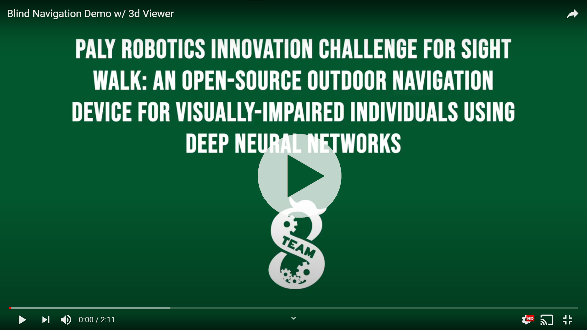
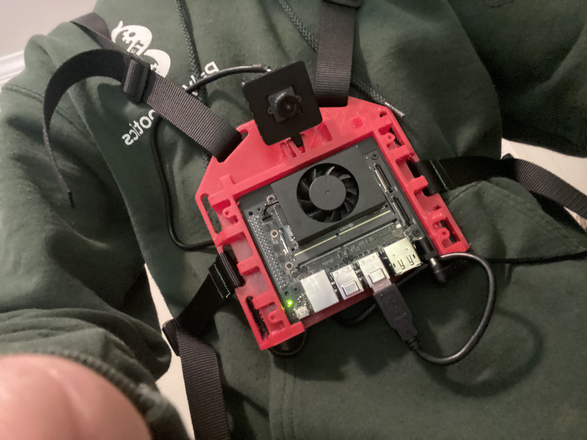
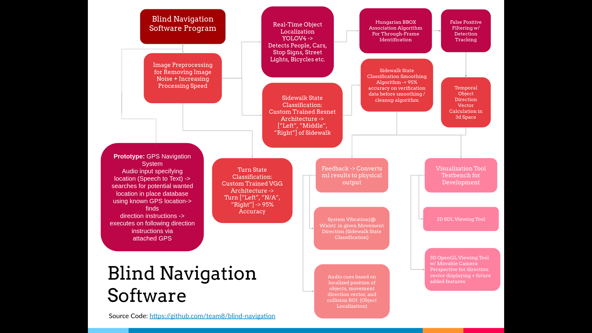
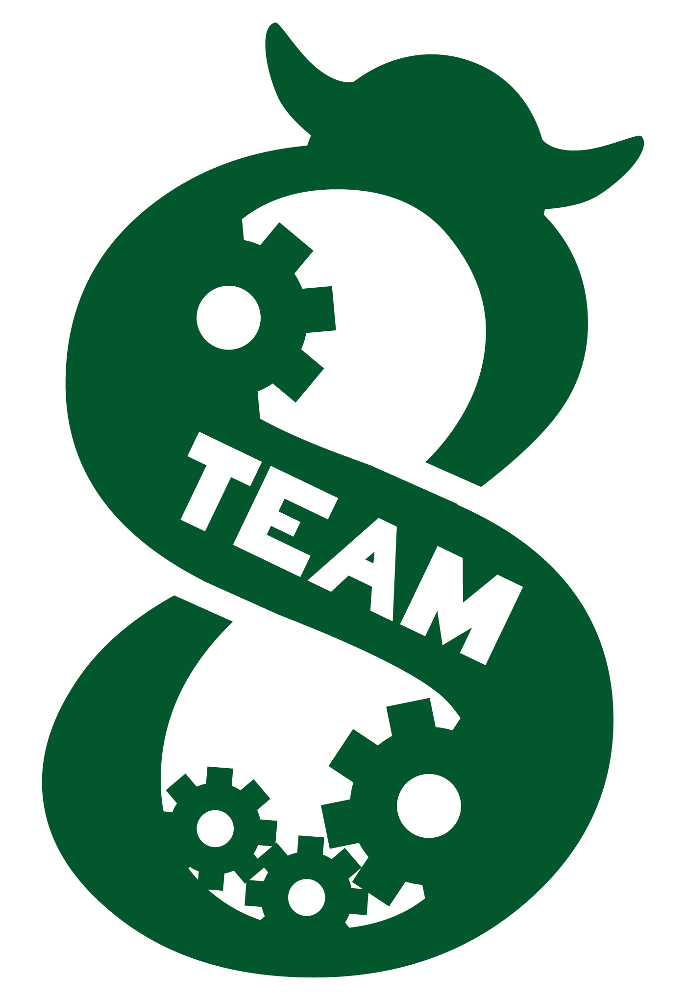

# SightWalk

## Project Description

SightWalk is an entirely open source visual assistance and sidewalk navigation device that helps visually-impaired individuals navigate outdoor environments. SightWalk uses neural network models that detect objects, such as people, cars, bikes, street signs, and more, and a custom trained deep neural network model to determine an individual’s position relative to a sidewalk. While the user is walking, a chest-mounted device using camera data evaluates the user’s surroundings and determines if the user is approaching a hazard or has drifted onto the road. The program sends signals to the chest-mounted device that vibrates and gives audio cues to alert the user of potential concerns, aiding users in the goal of safe outdoor exercise without the assistance of guides.

## Detection Demo

## Technical Details

The physical hardware we made for SightWalk is a 3d printed chest-mounted apparatus housing a Jetson ML-optimized computer (Xavier NX) powered via a lipo battery pack. One of the main considerations with our design was comfort and wearability and so the entire chest mount was printed in a flexible TPU filament so that it would contour to the user’s body shape.

## Design

## Physical Build

Attached to the chest mount is a camera which takes a live video stream of the surroundings of the blind individual upon which important data can be extrapolated. 
In order to determine the sidewalk state, we custom trained a convolutional neural network (CNN) to perform the classification problem. The CNN model uses Resnet architecture and was trained on a custom dataset of over 3000 images we took. Using this we can achieve around 95% accuracy - something that would improve further with a larger image dataset.

In order to identify obstacles such as cars, people, vehicles, stop signs, street lights, and other unseen hazards such as fire hydrants, we trained a YOLOV4-Tiny CNN model on the COCO image dataset. In order to track objects through frames, we wrote a custom tracking algorithm which can take the model’s inferences and associate detections through multiple frames (doing extra false positive and false negative detection removals simultaneously). We ended up with a highly accurate object detection pipeline as shown in the demo video.

In order to interact with the user, we also have a set of vibration motors which allow for dynamic steering of the course of the blind individual based on the detected sidewalk state in order to steer them away from the road. An ambient sound pass-through earbud set is used for higher resolution outputs which is more specifically used for communicating object detection data as well as for easy future functionality expandability.

Our demo video showcases the above features on top of our visualization tools. Most recently, we have worked on the development of the 3d viewing tool using OpenGL as shown in the beginning of the video which allows us to navigate around frames and view the three-dimensional movement direction vectors of detected objects.

## Blind Navigation Code Diagram

## Using the code
1. Install dependencies with `pip install -r `[`requirements.txt`](requirements.txt)
2. Build darknet as per the instructions in the darknet_builder folder or the github.com/AlexeyAB/darknet.git install instructions
3. Build pangolin in the uoip_pangolin folder within display_3d as per the github.com/uoip/pangolin.git install instructions
4. Run process_runner.py

## File Description

[process_runner.py](process_runner.py) manages all sub tasks.

[sidewalk_classification.py](sidewalk_classification) manages and provides sidewalk shift state inference.

[turn_classification.py](sidewalk_classification) manages and provides sidewalk turn state inference.

[detector.py](person_automobile_sign_detection/detector.py) manages and provides object localization inferences.

[detection.py](person_automobile_sign_detection/detection.py) models a detection tracked through time

[capturer.py](capturer.py) handles getting images from the camera

[display.py](display.py) handles displaying those images onto the 2d and 3d visualization tool

[feedback](feedback/) handles feedback to Jetson Xavier NX (waist vibration and audio cues)

## Future Plans

TODO:
* [ ] Convert to phone application
* [ ] Add more capabilities such as more sidewalk states, when to turn, when it is safe to cross the street, etc.
* [ ] Adding GPS + ML in order to make it easier to get to the destination
* [ ] Add more aids such as text recognition
* [ ] Monocular point slam

## Open Source & How to contribute

SightWalk is entirely open source, meaning all software, CAD designs, and image datasets are public. Public availability of projects are often the most effective way of fostering community growth onto a project and the continued improvement of a piece of tech. We heavily encourage anyone who is interested in participating to contribute!

1. Create a fork of this repository on github
2. Clone the fork you made ``git clone https://github.com/GITHUB-ACCOUNT-NAME/blind-navigation.git``
3. Download models and place them in the appropriate folders   [Model Download Link](https://drive.google.com/file/d/1AinPk80U0Euq6phM6UEneZsE8TIypnoy/view?usp=sharing)
4. Make a new branch with a descriptive name
5. Implement the new feature
6. Write test cases showing the robustness of the feature against multiple test cases and edge cases.
7. Submit a pull request detailing all changes made.

## Image Dataset Link

[Sidewalk Position Determination Dataset](https://drive.google.com/file/d/1hT2aOikyk8xYNjPstqaAtFY1kt-81E8O/view?usp=sharing)

We custom collected this dataset housing the images that would respectively indicate if an individual was left, right, or middle of the sidewalk. It has been weighted for training purposes with a left: 1000, right: 1000, middle: 1150 split. Augmentation has been preperformed on the data. 

Create a pull request with a zip file of the new images and a google drive link if you have more images to add!

## Acknowledgements
* Darknet (Yolov4), Pangolin (3d Opengl Visualizer), Pygame(2D SDL Visualizer), Tensorflow, Opencv

Create an issue if you have any questions

By Paly Robotics

