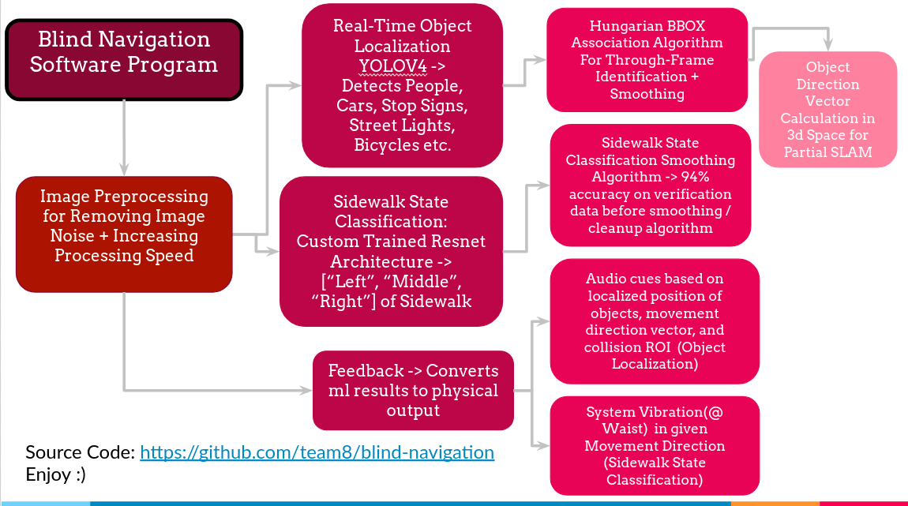

# Blind Navigation

## Detection Demo

## Blind Navigation Code Diagram

## File Description

process_runner.py manages all sub tasks.

sidewalk_classification.py manages and provides sidewalk state inference.

detector.py manages and provides object localization inferences.

detection.py models a detection tracked through time

capturer.py handles getting images from the camera

display.py handles displaying those images onto the visualization tool

feedback.py handles feedback to Jetson Xavier NX (waist vibration and audio cues)

